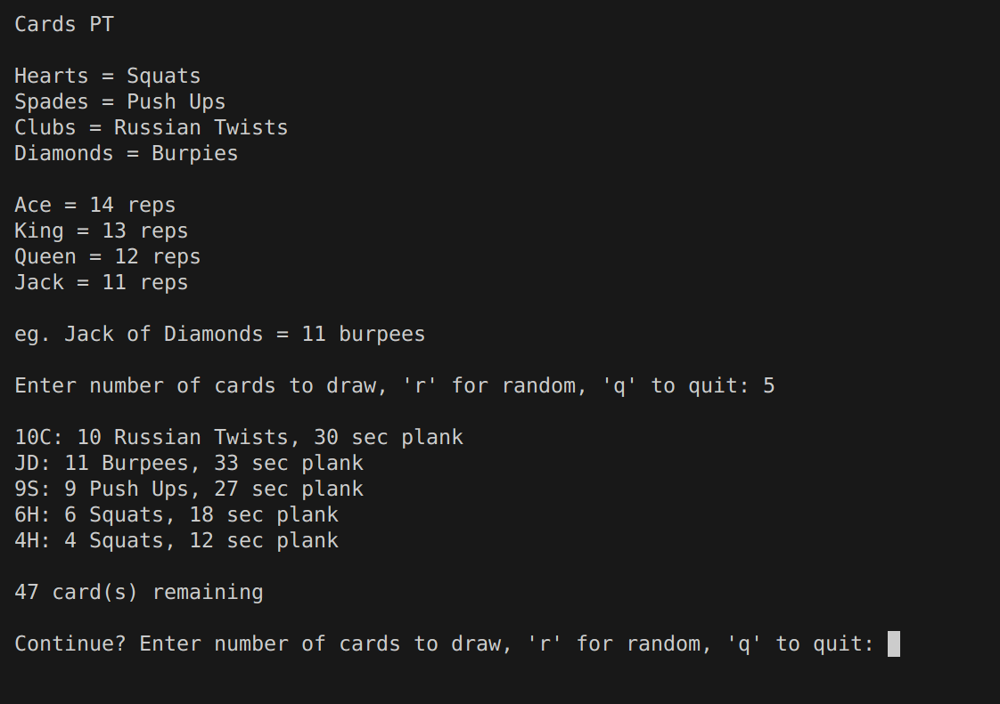

## Card PT

Deck of cards physical training

### Purpose

To replicate drawing a deck of cards and doing exercises based on the drawn card suit/rank<br>

Also a fun way to get in shape

### Preview



### How to use

Install python on your machine (Google)<br>

Run python with the file `PTCards.py` in correct directory<br>
ex. `python PTCards.py`

User will be prompted of how much cards to draw, random option available<br>

### Notes

```
Hearts = Squats
Spades = Push Ups
Clubs = Russian Twists
Diamonds = Burpees

Ace = 14 reps
King = 13 reps
Queen = 12 reps
Jack = 11 reps

eg. Jack of Diamonds = 11 burpees
```

Exercises should be done with minimal time in between cards (1-5 seconds)<br>

You can PT alone, or with a group. If with a group, you will hold a plank until everyone is done with the current exercise. When everyone is holding a plank position, you can move on to the next card.<br>
